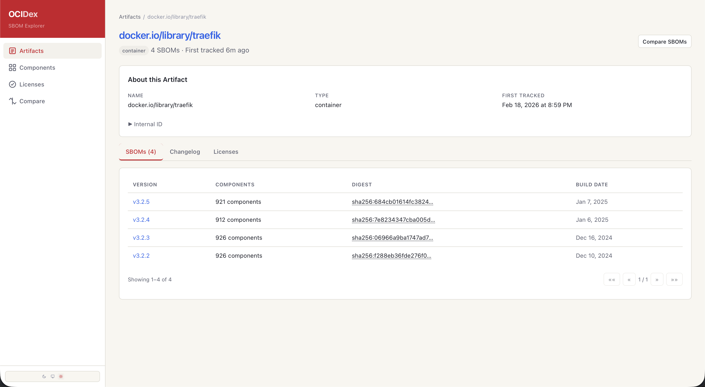
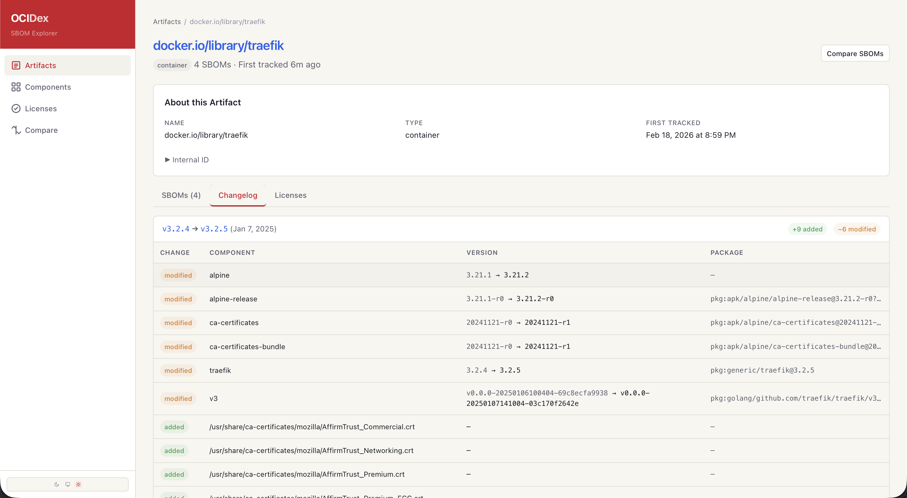
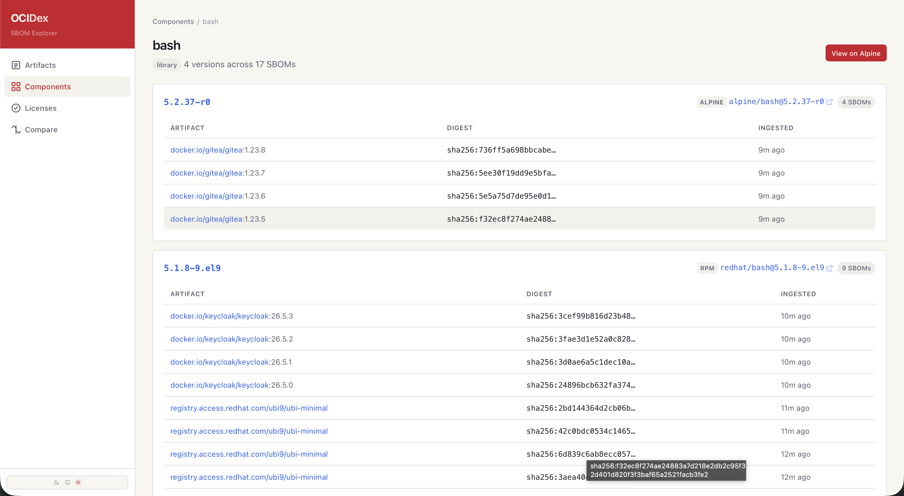

# OCIDex

**A metadata catalog for your software supply chain.**

OCIDex ingests [CycloneDX](https://cyclonedx.org/) SBOMs, links them to the software artifacts they describe, and gives you a searchable inventory of every component, version, and license across your entire portfolio — with a changelog that shows exactly what changed between releases.

<!-- Screenshots: replace these paths with your actual captures -->

<p align="center">
  
</p>

<p align="center">
  
</p>

<p align="center">
  
</p>

---

## Features

- **SBOM Ingestion** — POST a CycloneDX JSON document and OCIDex validates, parses, and stores it with full component and dependency graph data.
- **Artifact Tracking** — SBOMs are grouped by artifact (container image, library, application). Browse the full version history of any artifact.
- **Changelog** — See exactly which components were added, removed, or changed between any two SBOMs for an artifact.
- **SBOM Diffing** — Pick any two SBOMs across any artifacts and compare them side by side.
- **Component Search** — Find any package by name, group, or type across all ingested SBOMs. See which artifacts use it and how many versions exist.
- **License Inventory** — Every license found across your SBOMs in one place, categorized as permissive, weak-copyleft, or copyleft, with per-artifact summaries.
- **Enrichment Pipeline** — After ingestion, background workers enrich SBOMs with additional data. The built-in OCI metadata enricher pulls image labels, architecture, and build info directly from container registries.
- **OpenAPI Documentation** — The API spec is generated from code at startup via [huma](https://huma.rocks/). Browse it at `/docs`.

## Quick Start

### With Docker Compose

The fastest way to get a running instance with seed data:

```sh
git clone https://github.com/pfenerty/ocidex.git
cd ocidex
cp .env.example .env   # fill in GitHub OAuth credentials and SESSION_SECRET
docker compose up -d
```

This starts PostgreSQL, NATS JetStream, the OCIDex API server (port 8080), the scanner and enrichment workers, and the web frontend (port 3000). Database migrations run automatically on startup.

To populate it with real-world SBOMs from public container images:

```sh
# Requires oras, syft, and curl — available in the Flox dev environment
flox activate -- make seed
```

Then open [http://localhost:3000](http://localhost:3000).

### From Source

OCIDex uses [Flox](https://flox.dev/) to manage its development environment (Go, Node, npm, oras, syft, and other tools).

```sh
git clone https://github.com/pfenerty/ocidex.git
cd ocidex
flox activate

# Install Go tools (sqlc, golangci-lint)
make init

# Start PostgreSQL (via docker-compose, or provide your own)
docker compose up -d postgres

# Configure
cp .env.example .env   # edit DATABASE_URL if needed

# Run migrations and build
make migrate-up
make build
make frontend

# Start the server
./bin/ocidex
```

The API serves on `:8080` by default. For frontend development with hot reload:

```sh
make frontend-dev   # Vite dev server on :3000, proxies /api/* to :8080
```

### Ingest Your First SBOM

Generate an SBOM with [syft](https://github.com/anchore/syft) and send it to OCIDex:

```sh
syft registry:docker.io/library/nginx:latest -o cyclonedx-json | \
  curl -X POST http://localhost:8080/api/v1/sbom \
    -H "Content-Type: application/json" \
    -d @-
```

## Tech Stack

| Layer | Technology |
|-------|-----------|
| Language | Go |
| HTTP | [chi](https://github.com/go-chi/chi) + [huma](https://huma.rocks/) (code-first OpenAPI 3.1) |
| Database | PostgreSQL ([pgx](https://github.com/jackc/pgx) driver, [sqlc](https://sqlc.dev/) query gen, [goose](https://pressly.github.io/goose/) migrations) |
| Messaging | [NATS JetStream](https://docs.nats.io/nats-concepts/jetstream) (scan and enrichment job queue) |
| Frontend | [SolidJS](https://www.solidjs.com/) + [TanStack Query](https://tanstack.com/query) + [Tailwind CSS](https://tailwindcss.com/) |
| API Client | [openapi-fetch](https://openapi-ts.dev/openapi-fetch/) with generated TypeScript types |
| Testing | [matryer/is](https://github.com/matryer/is) (unit), [testcontainers-go](https://golang.testcontainers.org/) (integration) |
| Container | Docker multi-stage build (Alpine) |
| Dev Environment | [Flox](https://flox.dev/) |

## Project Structure

```
cmd/ocidex/              API server entry point, wiring, graceful shutdown
cmd/scanner-worker/      OCI registry scanner (NATS daemon + --once K8s Job mode)
cmd/enrichment-worker/   SBOM enrichment worker (NATS daemon + --once K8s Job mode)
internal/api/            HTTP handlers and routing (chi + huma)
internal/service/        Business logic interfaces and implementations
internal/repository/     Data access layer (sqlc-generated queries)
internal/enrichment/     Pluggable enrichment pipeline
internal/scanner/        OCI registry scanning (Syft engine)
internal/nats/           NATS JetStream client helpers
internal/jobqueue/       Generic outbox-pattern worker (Postgres → NATS doorbell)
internal/config/         Environment-based configuration
db/migrations/           SQL schema migrations (goose)
db/queries/              SQL query definitions (sqlc source of truth)
web/                     SolidJS frontend (Vite + Tailwind)
tests/                   Integration tests (testcontainers)
k8s/                     Kubernetes manifests (kustomize base + overlays)
docs/                    Architecture docs, ADRs, development guide
```

## API Overview

All endpoints are under `/api/v1`. The full OpenAPI spec is served at `/openapi.json` and an interactive docs UI at `/docs`.

| Method | Path | Description |
|--------|------|-------------|
| `POST` | `/api/v1/sbom` | Ingest a CycloneDX JSON SBOM |
| `GET` | `/api/v1/sbom` | List SBOMs (paginated, filterable) |
| `GET` | `/api/v1/sbom/{id}` | Get SBOM detail |
| `GET` | `/api/v1/sbom/{id}/components` | List components in an SBOM |
| `GET` | `/api/v1/sbom/{id}/dependencies` | Get dependency graph |
| `GET` | `/api/v1/artifacts` | List tracked artifacts |
| `GET` | `/api/v1/artifacts/{id}` | Get artifact detail |
| `GET` | `/api/v1/artifacts/{id}/sboms` | List SBOMs for an artifact |
| `GET` | `/api/v1/artifacts/{id}/changelog` | Get changelog between SBOMs |
| `GET` | `/api/v1/artifacts/{id}/license-summary` | License breakdown for latest SBOM |
| `GET` | `/api/v1/components` | Search components |
| `GET` | `/api/v1/components/distinct` | Deduplicated component search |
| `GET` | `/api/v1/licenses` | List all licenses |
| `GET` | `/api/v1/diff` | Diff any two SBOMs |

Errors follow [RFC 7807](https://www.rfc-editor.org/rfc/rfc7807) problem details format.

## Configuration

OCIDex is configured via environment variables:

See [docs/CONFIGURATION.md](docs/CONFIGURATION.md) for the full reference. Key variables:

| Variable | Default | Description |
|----------|---------|-------------|
| `DATABASE_URL` | — | PostgreSQL connection string (required) |
| `NATS_URL` | — | NATS server URL (required for API + both workers) |
| `PORT` | `8080` | HTTP listen port (API server) |
| `LOG_LEVEL` | `info` | Log level (`debug`, `info`, `warn`, `error`) |
| `ENVIRONMENT` | `development` | Runtime environment |
| `GITHUB_CLIENT_ID` | — | GitHub OAuth app client ID (required for login) |
| `GITHUB_CLIENT_SECRET` | — | GitHub OAuth app client secret |
| `SESSION_SECRET` | — | Session signing key (required; generate with `openssl rand -hex 32`) |
| `FRONTEND_URL` | `http://localhost:3000` | Frontend origin (used for CORS and OAuth redirect) |
| `NATS_STREAM_NAME` | `ocidex` | JetStream stream name |
| `SCANNER_MAX_CONCURRENCY` | `10` | Max parallel scans per scanner-worker pod |
| `ENRICHMENT_MAX_CONCURRENCY` | `10` | Max parallel enrichments per enrichment-worker pod |

## Documentation

| Document | Description |
|----------|-------------|
| [Architecture](docs/ARCHITECTURE.md) | System design, data model, and component overview |
| [Development Guide](docs/DEVELOPMENT.md) | Coding patterns, testing strategy, and stack examples |
| [Configuration](docs/CONFIGURATION.md) | All environment variables with descriptions and defaults |
| [Deployment](docs/DEPLOYMENT.md) | Production deployment guide (K8s + Flux) |
| [Ephemeral Jobs](docs/EPHEMERAL_JOBS.md) | K8s Job / `--once` mode for scanner and enrichment workers |
| [API Versioning](docs/API_VERSIONING.md) | Versioning policy and breaking-change definition |
| [Architecture Decision Records](docs/adr/) | 27 ADRs documenting every major technical choice |
| [How AI Was Used](docs/AI.md) | Transparent account of AI's role in development |

## Releases

OCIDex follows [semantic versioning](https://semver.org/). See [CHANGELOG.md](CHANGELOG.md) for the per-version history (generated by [git-cliff](https://git-cliff.org) from conventional commits).

To cut a new release from `main`:

```sh
make release VERSION=v0.1.0
git push origin main v0.1.0
```

The release workflow (`.github/workflows/release.yml`) then builds multi-arch (linux/amd64, linux/arm64) container images for `api`, `scanner-worker`, `enrichment-worker`, and `web`, pushes them to `ghcr.io/pfenerty/ocidex-*` tagged with the semver version (plus `latest` for stable releases), and creates a GitHub Release with the changelog as the body. Images carry the standard `org.opencontainers.image.*` annotations and binaries embed their build version (`ocidex --version`).

## AI Acknowledgment

This project was built with significant AI assistance (Claude). Architecture decisions, technology selection, and code review are human-driven; implementation, refactoring, and documentation are collaborative. See [How AI Was Used](docs/AI.md) for the full picture.

## License

[MIT](LICENSE)
